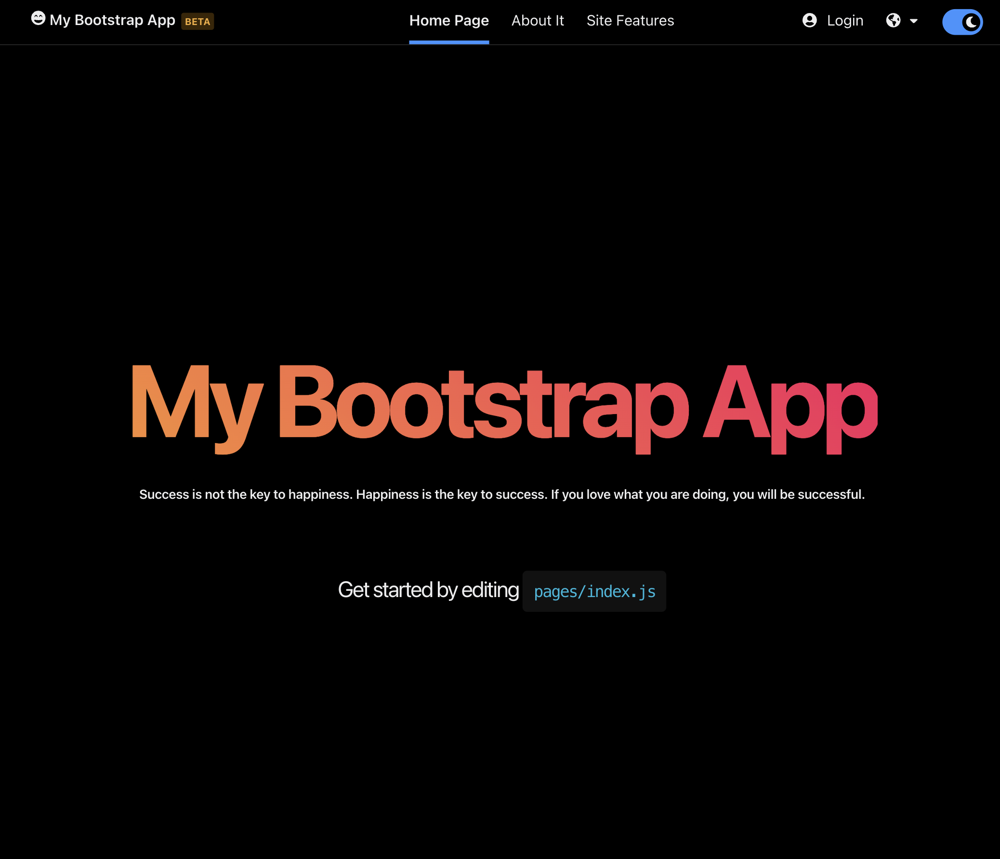
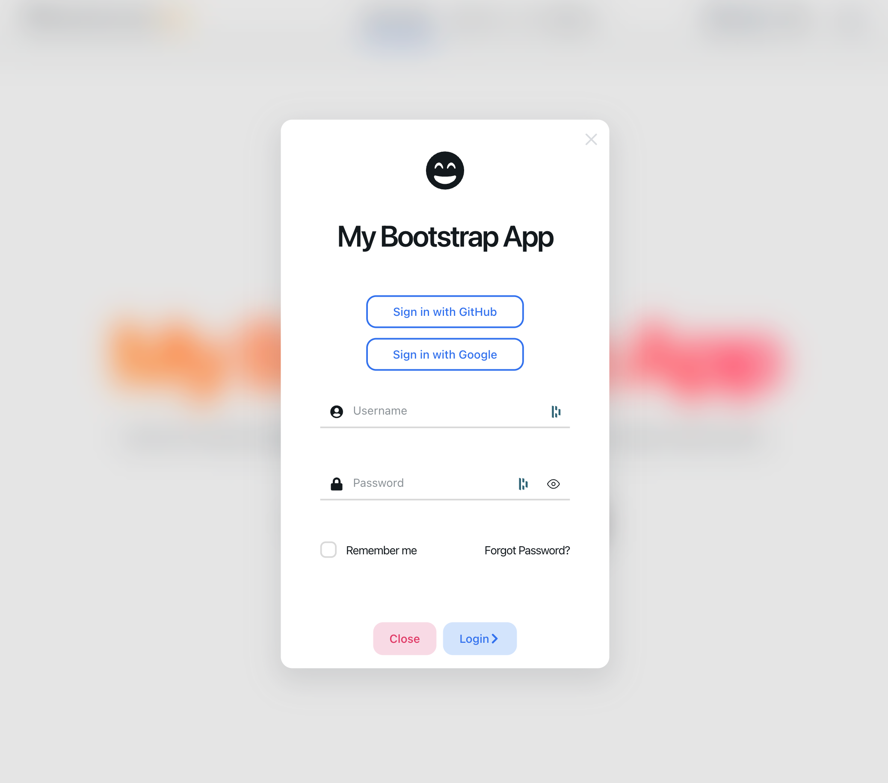
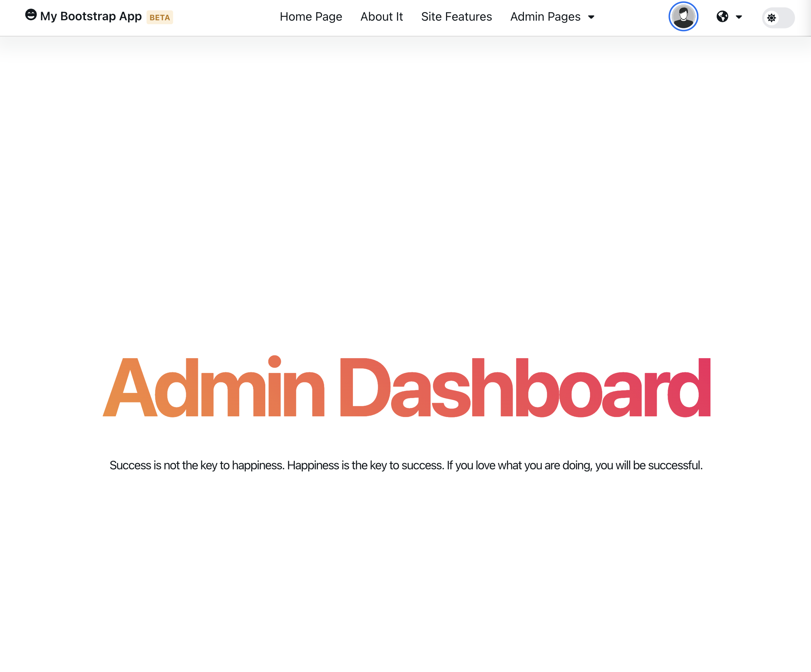
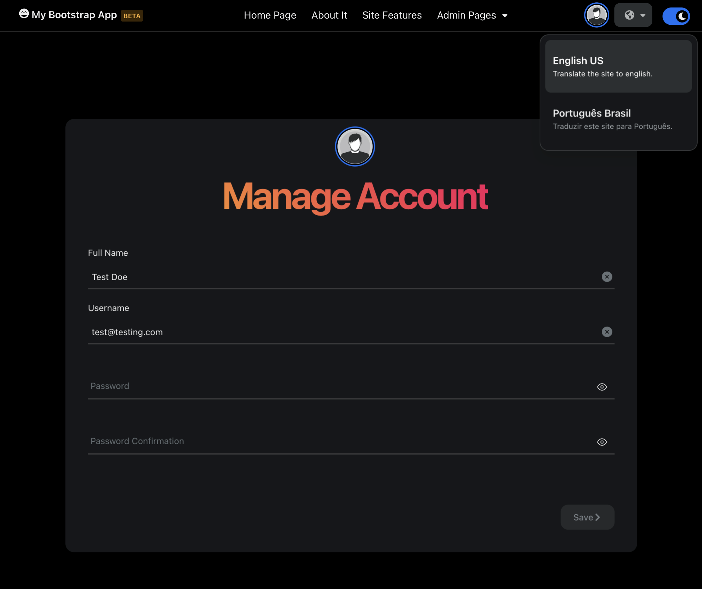
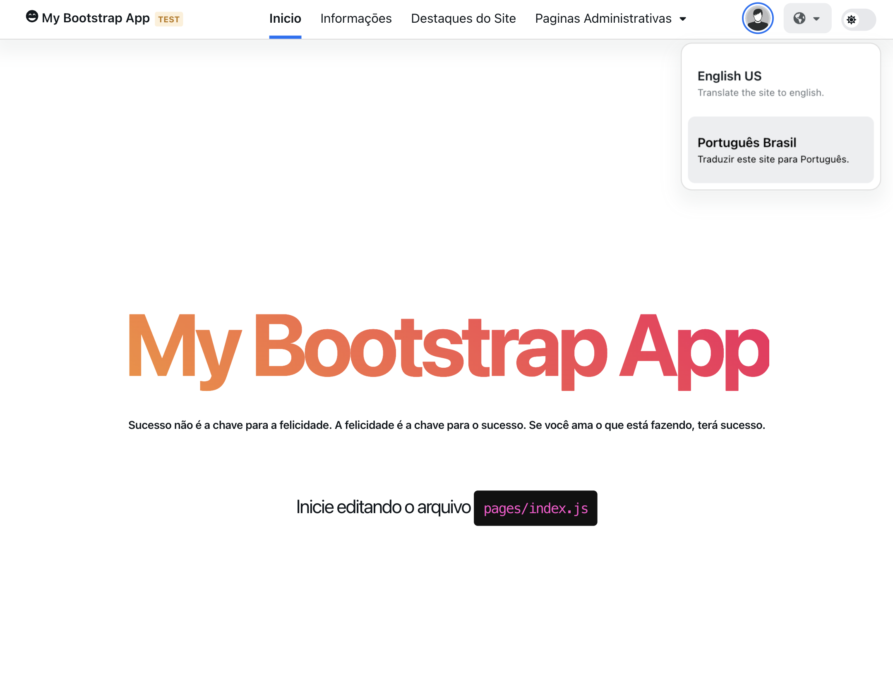
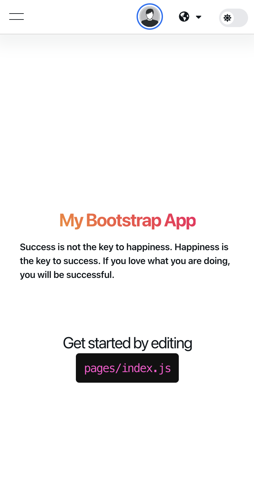
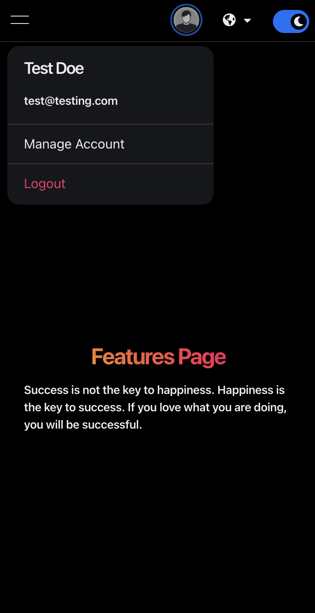

# Bootstrap APP
This is a skeleton that contain basic UI/UX functionality to start any project that demand a restricted area. 

# How to Use

# References
All references used in thsi project.
## Base Framework
https://nextjs.org/docs/getting-started
## Fonts:
 https://react-icons.github.io/react-icons/icons?name=fa
## Theme:
https://nextui.org/docs/guide/getting-started
## Auth:
https://next-auth.js.org/getting-started/introduction

## Internationalization
https://github.com/i18next/next-i18next
https://nextjs.org/docs/advanced-features/i18n-routing

## Dummy Data
https://dummyjson.com/

# Visuals

  

  

  

  

  

  

  

